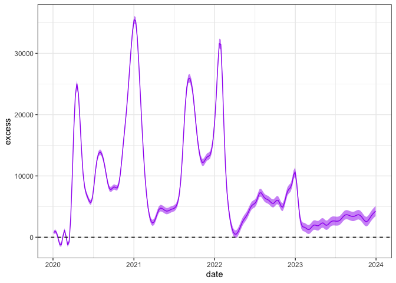

# Plotting expeected versus observed mortality with excessmort prackage
Rafael A. Irizarry

## Introduction

This file contains two parts. First the data wrangling part, which is
somewhat complex. Then we compute expected death counts and plot along
with observed counts. This is relatively simple with the `excessmort`
package. We add examples of how to estimate excess mortality.

<div>

> **Important**
>
> This document is meant as an example of how to use the `excessmort`
> package, not as a final analysis of excess mortality in the US. The
> excess mortality calculation presented here assumes the trend observed
> from 2017-2020 would have continued past 2020 until the end of 2023
> had the pandemic not occurred. Different assumptions for the
> extrapolation can lead to substantially different conclusions. The
> `excessmort` package can be used for this type of sensitivity analysis
> as well. Finally, note that for a final analysis I recommend
> performing a per-state and per age-strata analysis.

</div>

## Data wrangling

The first step is download data death count data from the CDC.

``` r
library(httr2)
library(jsonlite)
library(data.table)
library(lubridate)
library(excessmort)
mmwr_to_date <- function(mmwr_year, mmwr_week) {
  first_day <- floor_date(make_date(mmwr_year, 1, 4) , unit = "week")
  date <- first_day + weeks(mmwr_week - 1) + days(6) ## plus six to get week_end
  return(date)
}

api <- "https://data.cdc.gov/resource/3yf8-kanr.json"
dt2014_2019 <- request(api) |> 
  req_url_query("$limit" = 10000000) |>
  req_perform() |> resp_body_string() |> 
  fromJSON(flatten = TRUE) |>
  setDT()

dat1 <- dt2014_2019[jurisdiction_of_occurrence == "United States"]
dat1[, date := as_date(weekendingdate)]
dat1 <- dat1[, c("date", "allcause")]
setnames(dat1, "allcause", "outcome")

api <- "https://data.cdc.gov/resource/r8kw-7aab.json"
dt2020_present <- request(api) |> 
  req_url_query("$limit" = 10000000) |>
  req_perform() |> resp_body_string() |> 
  fromJSON(flatten = TRUE) |>
  setDT()

dat2 <- dt2020_present[state == "United States" & group == "By Week"]
dat2 <- dat2[, c("end_date", "total_deaths")]
setnames(dat2, c("end_date", "total_deaths"), c("date", "outcome"))
dat2[, date := as_date(date)]

dat <- rbindlist(list(dat1, dat2))
dat[, outcome := as.numeric(outcome)]
dat <- dat[date <= as_date("2023-12-31")]
dat <- dat[order(date),]
```

Next we get population estimates from the US Census. You will need a
census API key which you can get from
<https://api.census.gov/data/key_signup.html>. Create a file called
`census-key.R` in your working directory with the following line in it:

``` r
census_key <- "YOURKEYHERE"
```

Next you can obtain population with this code:

``` r
source("census-key.R") 

api <- "https://api.census.gov/data/2019/pep/population"
pop1 <- request(api) |>  
  req_url_query(get = I("POP,DATE_CODE,DATE_DESC"), 
                `for` = I("us:*"),
                key = census_key) |>
  req_perform() |>
  resp_body_string() |> 
  fromJSON(flatten = TRUE) |>
  as.data.table()

pop1 <- pop1 |> janitor::row_to_names(1) 
pop1 <- pop1[!grepl("4/1", DATE_DESC)]
pop1 <- data.table(year = 2010 + as.numeric(pop1$DATE_CODE) - 3, population = as.numeric(pop1$POP))

pop2_all <- fread("https://www2.census.gov/programs-surveys/popest/datasets/2020-2023/state/totals/NST-EST2023-ALLDATA.csv") 
years <- 2020:2023
pop2 <- pop2_all[NAME == "United States", ]
cols <- paste0("POPESTIMATE", years)
pop2 <- data.table(year = years, population = unlist(pop2[,..cols]))

pop <- rbindlist(list(pop1,pop2))[order(year)]
pop <- approx_demographics(pop, first_day = min(dat$date), last_day = max(dat$date))
```

Finally, merge the population and mortality counts data.

``` r
dat <- merge(dat, pop, by = "date", all.x = TRUE)
```

## Computing expected counts

``` r
library(tidyverse)
```

Because there was an upward trend from 2014 to 2016 that seemed to have
leveled off in 2017 we use only data from 2017 to 2020 to estimated
expected counts.

``` r
dat <- dat[date >= make_date(2017,1,1)]
```

We exclude two flu seasons that were worse than usual along with the
dates since the pandemic started:

``` r
exclude_dates <- c(seq(make_date(2017, 1, 1), make_date(2017, 2, 15), by = "day"),
                   seq(make_date(2018, 1, 1), make_date(2018, 2, 15), by = "day"),
                   seq(make_date(2020, 3, 1), make_date(2023, 12, 31), by = "day"))
```

Now we use the `excessmort` package:

``` r
expected <- compute_expected(dat, exclude = exclude_dates)
```

    No frequency provided, determined to be 52 measurements per year.

    Overall death rate is 9.38.

## Observed versus expected plot

To make the plot we use the `expected_diagnostic` function which we
recommend always using when performing this type of analysis. This is
particularly important when you are extrapolating.

``` r
diagnostics <- expected_diagnostic(expected)
diagnostics$expected + ggtitle("Total deaths in the USA from 2017 to 2023")
```


## Excess mortality

We can also use this package to estimate excess mortality **assuming the
expected mortality model extrapolates correctly**. We compute it for
every year in the pandemic

``` r
em <- excess_model(expected, start = make_date(2015, 1, 1), end = make_date(2023, 12, 31), exclude = exclude_dates, 
                   knots.per.year = 18, 
                   intervals = list(seq(make_date(2020, 1, 1), make_date(2020, 12, 31), by = "day"),
                                    seq(make_date(2021, 1, 1), make_date(2021, 12, 31), by = "day"),
                                    seq(make_date(2022, 1, 1), make_date(2022, 12, 31), by = "day"),
                                    seq(make_date(2023, 1, 1), make_date(2023, 12, 31), by = "day")))
```

We can then make a table of excess deaths:

``` r
em$excess |> mutate(year = year(start)) |> mutate(lower = excess - 1.96*sd, upper = excess + 1.96*sd) |>
  select(year, excess, lower, upper) |>
  mutate(across(-year, function(x) paste0(round(x/1000,1),"K"))) |>
  arrange(desc(year)) |>
  knitr::kable()
```

| year | excess | lower  | upper  |
|-----:|:-------|:-------|:-------|
| 2023 | 145.9K | 135.7K | 156.2K |
| 2022 | 378.4K | 368.1K | 388.7K |
| 2021 | 576.7K | 566.6K | 586.9K |
| 2020 | 479.9K | 469.7K | 490K   |

and a plot:

``` r
tibble(date = em$date, obs = em$observed, excess = em$expected*(exp(em$fitted) - 1), 
       upper = em$expected*(exp(em$fitted + 1.96*em$log_expected_se) - 1),
       lower = em$expected*(exp(em$fitted - 1.96*em$log_expected_se) - 1)) |>
  filter(date >= make_date(2020,1,1)) |>
  ggplot(aes(date, excess)) +
  geom_ribbon(aes(ymin = lower, ymax = upper), alpha = 0.5, fill = "purple") +
  geom_line(color = "purple") +
  geom_hline(yintercept = 0, lty = 2) +
  theme_bw()
```



## State-by-state analysis

We start by wrangling data again but keeping state level info.

``` r
dat3 <- dt2014_2019[jurisdiction_of_occurrence != "United States"]
dat3[, date := as_date(weekendingdate)]
dat3 <- dat3[, c("jurisdiction_of_occurrence", "date", "allcause")]
setnames(dat3, c("jurisdiction_of_occurrence", "allcause"), c("state", "outcome"))

dat4 <- dt2020_present[state != "United States" & group == "By Week"]
dat4 <- dat4[, c("state", "end_date", "total_deaths")]
setnames(dat4, c("end_date", "total_deaths"), c("date", "outcome"))
dat4[, date := as_date(date)]

dat_states <- rbindlist(list(dat3, dat4), use.names = TRUE)
dat_states[, outcome := as.numeric(outcome)]
## combine NY state and NY city
dat_states[state == "New York City", state := "New York"]
dat_states[, outcome := sum(outcome), by = c("state", "date")]
dat_states <- dat_states[date <= as_date("2023-12-31") & state != "New York City"]
dat_states <- dat_states[order(date),]


pop1_all <- request(api) |>  
  req_url_query(get = I("POP,DATE_CODE,DATE_DESC,NAME"), 
                `for` = I("state:*"),
                key = census_key) |>
  req_perform() |>
  resp_body_string() |> 
  fromJSON(flatten = TRUE) |>
  as.data.table()
pop3 <- pop1_all |> janitor::row_to_names(1) 
pop3 <- pop3[!grepl("4/1", DATE_DESC)]
pop3 <- with(pop3, data.table(year = 2010 + as.numeric(DATE_CODE) - 3, 
                       state = NAME,
                       population = as.numeric(POP)))

pop4 <- pop2_all[NAME %in% pop3$state, ]
cols <- c("NAME", paste0("POPESTIMATE", years))
pop4 <- pop4[,..cols] |>
   melt(id.vars = "NAME", 
        variable.name = "year", 
        value.name = "population")
pop4[, year := as.numeric(gsub("POPESTIMATE", "", year))]
setnames(pop4, "NAME", "state")

pop_states <- rbindlist(list(pop3, pop4), use.names = TRUE)[order(state, year)]
pop_states <- approx_demographics(pop_states)


dat_states <- merge(dat_states, pop_states, by = c("state", "date"), all.x = TRUE)
```

Now we compute expected for each state:

Now we make the plot (we order states by excess deaths per capita)

``` r
state_order <- expected[date >= make_date(2020,1,1), .(excess = sum((outcome - expected)/population)), by = state][order(-excess)]$state

expected |> mutate(state = factor(state, levels = state_order)) |> 
  ggplot(aes(x = date)) + 
  geom_point(aes(y = outcome/population * 1000 * 52), size = 0.5) + 
  geom_line(aes(y = expected/population * 1000 * 52), color = "red") + 
  xlab("Date") +
  ylab("Deaths per 1,000 per 365 days") + 
  ggtitle("Death rates in the USA states from 2017 to 2023") +
  facet_wrap(~state)
```


